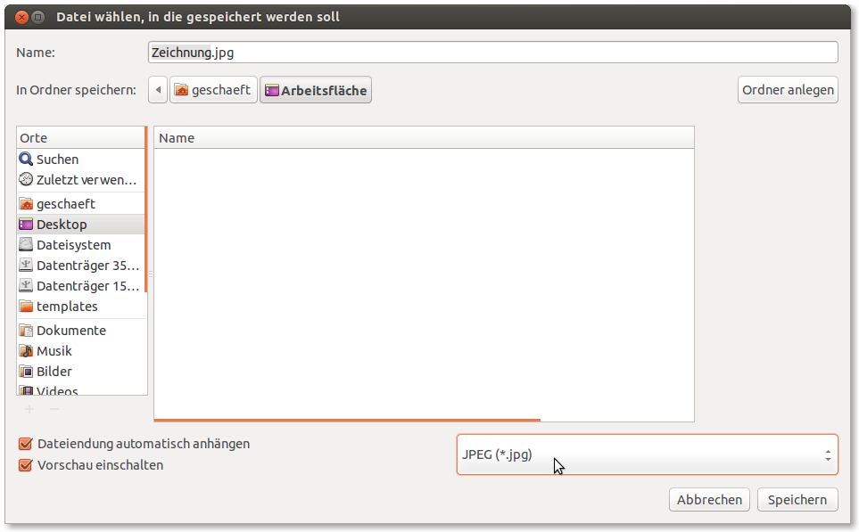

SVG to JPG conversion for Inkscape
==================================

This plugin adds the JPG file type to Inkscape's "Save as..." dialog.

Dependencies: Imagemagick and Bash. Imagemagick's `convert` command must be in the path of the user running Inkscape, Bash should come with most Linux distributions.

This is an early release, `inkscape-svg2jpg` has been tested in Linux only. If you find any bugs, please let me know.

Installation
------------

Install Imagemagick using your package manager of choice.
On Debian based systems, do

    sudo apt-get install imagemagick

Copy `svg2jpg.sh` and `svg2jpg.inx` to Inkscape's system-wide extension directory `/usr/share/inkscape/extensions/`, or to a user extension directory `$HOME/.config/inkscape/extensions/`.

System-wide installation

    cp svg2jpg.* /usr/share/inkscape/extensions/

Or installation for current user

    mkdir -p ~/.config/inkscape/extensions
    cp svg2jpg.* ~/.config/inkscape/extensions

Usage
-----

After installation, restart Inkscape. You should now be able to select the JPG format when saving an SVG drawing.

TODO
----

- Check for Imagemagick's `convert` executable.
